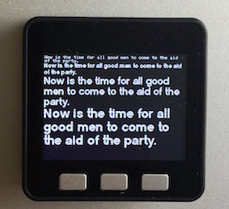

# Micropython Driver for ILI9341 display

This has been tested on an M5Stack module using the standard esp32 micropython port. The default font is the Adafruit glcdfont and additional fonts can be generated by a very slightly modified version of Peter Hinch's font-to-py program which includes a function in font file to return the pixel width of a string of characters.

